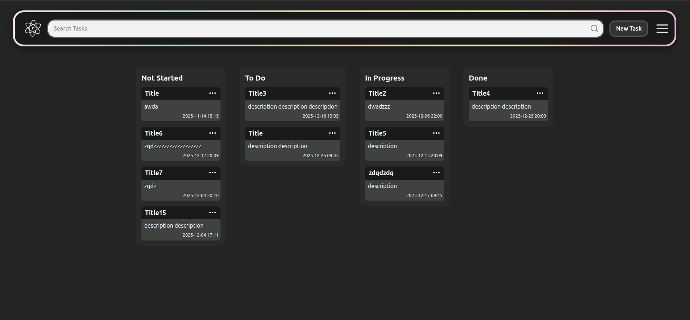

# Etodo — Task Management Web Application

<p align="center">
  
</p>

Etodo est une application web moderne permettant de gérer vos tâches via un tableau **Kanban** intuitif.  
Elle permet de créer, organiser, modifier, rechercher et supprimer des tâches facilement.  
Le projet est composé d'un **Front-End**, **Back-End**, et d'une **base de données MySQL**, le tout orchestré avec **Docker**.

---

## Table des matières
1. [À propos du projet](#à-propos-du-projet)
2. [Technologies utilisées](#technologies-utilisées)
3. [Prérequis](#prérequis)
4. [Installation](#installation)
5. [Configuration](#configuration)
6. [Lancement de l'application](#lancement-de-lapplication)
7. [Utilisation](#utilisation)
8. [Fonctionnalités](#fonctionnalités)
9. [Contribuer](#contribuer)
10. [Licence](#licence)
11. [Contact](#contact)

---

## À propos du projet

Etodo est conçu pour offrir une expérience simple, fluide et efficace dans la gestion de tâches.  
Grâce à son interface en colonnes **Not Started**, **To Do**, **In Progress**, et **Done**, vous pouvez organiser visuellement votre travail.

**Voici pourquoi Etodo est pratique :**

- Interface moderne et intuitive  
- Kanban clair et facile à manipuler  
- Expérience utilisateur fluide  
- Fonctionnalités complètes (CRUD tâches, recherche, thèmes, paramètres, compte...)  

<p align="center">
  
</p>

---

## Technologies utilisées

### Front-End
- React
- Vite
- TailwindCSS

### Back-End
- Node.js  
- Express  
- JWT  

### Base de données
- MySQL  

### Infrastructure
- Docker  
- Docker Compose  

---

## Prérequis

- Docker et Docker Compose  
- Navigateur moderne  
- Fichier `.env` configuré  

---

## Installation

Clonez le projet puis lancez :

```bash
docker compose up -d --build
```

Si nécessaire (avec sudo) :

```bash
sudo docker compose up -d --build
```

---

## Configuration

Si le fichier `.env` est absent, créez-le avec :

```env
MYSQL_DATABASE=todoapp
MYSQL_HOST=db
MYSQL_USER_BACK=<votre_utilisateur>
MYSQL_ROOT_PASSWORD=<votre_mot_de_passe>
PORT=3000
JWT_SECRET=<votre_secret_jwt>
```

**Important :** N'oubliez pas d'adapter les valeurs selon votre configuration.

---

## Lancement de l'application

### Démarrer les conteneurs

```bash
docker compose up -d --build
```

### Ouvrir dans un navigateur

Accédez à l'application via : **http://localhost:5173**

L'application est prête à être utilisée !

---

## Utilisation

### Authentification

**Inscription :**
- Prénom
- Nom
- Email
- Mot de passe

**Connexion :**
- Email
- Mot de passe

### Créer une tâche

1. Cliquez sur **New Task**
2. Renseignez les informations :
   - Titre
   - Description
   - Date d'échéance
   - Statue
3. Cliquez sur **Add**

La tâche apparaît dans la colonne sélectionner

### Gérer les tâches

- **Déplacer une tâche :** glissez-déposez entre les colonnes (drag & drop)
- **Modifier :** cliquez sur **Update**
- **Supprimer :** cliquez sur l'icône poubelle dans le formulaire d'édition

### Rechercher des tâches

Utilisez la barre de recherche en haut de l'écran et entrez le titre de la tâche recherchée.

### Menu déroulant

Accessible en haut à droite de l'interface :

- **Light / Dark mode** : basculer entre thème clair et sombre
- **Settings** : accéder aux paramètres du compte
- **Logout** : se déconnecter

### Page Paramètres

Dans les paramètres, vous pouvez :

- Modifier votre prénom, nom et email
- Changer votre mot de passe
- Supprimer votre compte
- Confirmer les modifications avec **Confirm**
- Revenir au tableau avec **Todo**

---

## Fonctionnalités

- ✅ Authentification JWT sécurisée
- ✅ Tableau Kanban interactif
- ✅ CRUD complet sur les tâches
- ✅ Glisser-déposer (drag & drop)
- ✅ Thème clair/sombre
- ✅ Recherche de tâches intégrée
- ✅ Gestion des paramètres utilisateur
- ✅ Suppression de compte
- ✅ Architecture conteneurisée avec Docker

---

## Contact

**Lilian Davezac**

- GitHub : [LiIian47](https://github.com/LiIian47)
- LinkedIn : [Profil LinkedIn](https://www.linkedin.com/in/lilian-davezac-392990397/)
